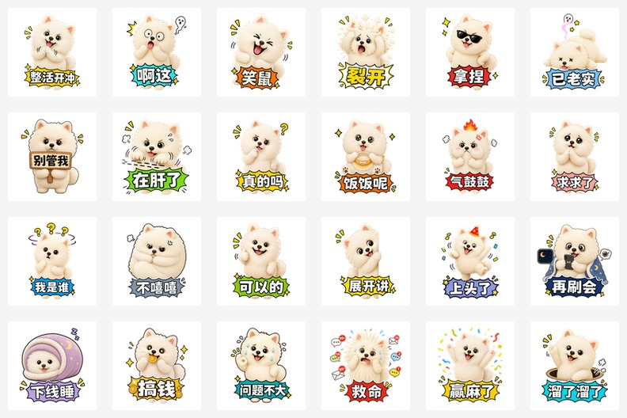

# Generate WeChat Stickers / 微信表情包生成 Skill

English | [中文](#中文说明)

Generate WeChat sticker packs from a character idea, theme, or reference image. This Codex skill helps create static sticker albums, Seedance-powered animated GIF albums, album assets, metadata, preview grids, and QC reports.

从角色设定、主题或参考图出发，生成微信表情包。这个 Codex Skill 支持静态表情专辑、基于 Seedance 视频的动态 GIF 表情、专辑素材、元数据、预览图和 QC 报告。

## Mature Examples

### Static Pack: `xiaojingling-gemin-magic-stickers`



- EN: A mature static 24-pack case. It uses image-generated original sticker artwork, then deterministic postprocessing for sizing, thumbnails, metadata, banner, reward assets, and review preview.
- 中文：成熟静态 24 张案例。先用图像生成原创表情素材，再用本地确定性流程处理尺寸、缩略图、元数据、横幅、赞赏图和预览图。

### Animated Pack: `xiaojingling-gemin-game-8-animated-20260521`


Single animated sticker sample:


- EN: A mature Seedance video-route animated case. Each sticker records Seedance video source, first/last frame inputs, MP4 output, keyed GIF output, thumbnails, and task reports.
- 中文：成熟 Seedance 视频路线动态案例。每个表情记录首尾帧、Seedance 视频任务、MP4、抠绿后的透明 GIF、缩略图和任务报告。

More notes: [examples/README.md](examples/README.md)

## What It Supports

- Static WeChat sticker albums: 8, 16, or 24 stickers.
- Animated WeChat sticker albums through Doubao Seedance video generation.
- Transparent green-screen GIF and designed-background GIF workflows.
- Album assets: cover, chat icon, banner, reward guide image, reward thanks image.
- Metadata, manifest, thumbnails, preview grid, QC reports, and zip packaging.
- Guardrails against bad workflows: reference-image cutout packs, local still-loop fallback, Emoji-derived assets, national flags, stale candidates, dirty keying, and outdated QC reports.

## 支持能力

- 静态微信表情专辑：8 / 16 / 24 张。
- 基于豆包 Seedance 视频生成的动态微信表情专辑。
- 透明绿幕 GIF 和有主题背景 GIF 两种动态路线。
- 专辑素材：封面、聊天面板图标、详情页横幅、赞赏引导图、赞赏致谢图。
- 元数据、manifest、缩略图、预览宫格、QC 报告和 zip 打包。
- 规避常见低级错误：直接抠参考图加字、本地假动效、Emoji 二创素材、国旗素材、候选文件选错、绿幕抠不干净、QC 报告过期。

## Repository Contents

```text
generate-wechat-stickers/
├── SKILL.md
├── agents/openai.yaml
├── references/
│   ├── emotion-presets.md
│   ├── prompt-rules.md
│   └── wechat-spec.md
├── scripts/
│   ├── run_wechat_sticker_pipeline.py
│   ├── seedance_video_task.py
│   ├── process_seedance_green_video.py
│   └── wechat_sticker_pack.py
├── docs/
│   └── seedance-ark-setup.md
└── examples/
    ├── README.md
    └── previews/
```

## Requirements / 环境要求

- Python 3.9+
- Pillow
- ffmpeg on `PATH`
- Codex image generation capability for creative source images
- Volcengine Ark API Key for Seedance animated video mode

中文：

- Python 3.9+
- Pillow
- 命令行可访问 `ffmpeg`
- Codex 图像生成能力，用来生成原创素材
- 火山方舟 Ark API Key，用于 Seedance 动态视频路线

Install dependency / 安装依赖：

```bash
python3 -m pip install -r requirements.txt
```

Check ffmpeg / 检查 ffmpeg：

```bash
ffmpeg -version
```

## Install As A Codex Skill / 安装为 Codex Skill

Clone this repository into your Codex skills directory:

把仓库克隆到 Codex skills 目录：

```bash
mkdir -p "$HOME/.codex/skills"
git clone https://github.com/kim-wing/generate-wechat-stickers.git \
  "$HOME/.codex/skills/generate-wechat-stickers"
```

Restart Codex, then ask:

重启 Codex 后，可以这样使用：

```text
Use $generate-wechat-stickers to create a 16-pack animated WeChat sticker album.
```

```text
使用 $generate-wechat-stickers 生成一套 16 张动态微信表情包，角色是一只奶油白毛绒小狗，主题是努力奋斗。
```

## Seedance API Setup / Seedance API 申请与配置

Animated sticker generation uses Volcengine Ark video generation API with Doubao Seedance 1.5 Pro by default.

动态表情默认使用火山方舟视频生成 API，模型路线为豆包 Seedance 1.5 Pro。

Set your key as an environment variable:

把 API Key 设置成环境变量：

```bash
export ARK_API_KEY="your_api_key_here"
```

Do not paste real keys into prompts, scripts, manifests, reports, command history, or GitHub issues.

不要把真实 API Key 写进 prompt、脚本、manifest、报告、命令历史或 GitHub issue。

Official setup guide / 官方配置说明：

- [Seedance / Ark setup guide](docs/seedance-ark-setup.md)
- [Ark product page / 火山方舟产品页](https://www.volcengine.com/product/ark)
- [Ark API Key guide / API Key 配置](https://www.volcengine.com/docs/82379/1541594)
- [Video generation API / 视频生成 API](https://www.volcengine.com/docs/82379/1520757)
- [Free inference quota / 免费推理额度](https://www.volcengine.com/docs/82379/1399514)
- [Seedance resource package rules / Seedance 资源包规则](https://www.volcengine.com/docs/82379/2191775)

Free quota and model access change over time. Always check the Ark console before running a large batch.

免费额度和模型开通规则会变化。正式批量生成前，请以火山方舟控制台显示为准。

## Basic Usage / 基础用法

### Static Pack / 静态表情包

Prompt Codex with:

可以这样对 Codex 说：

```text
Use $generate-wechat-stickers to create a static 24-pack WeChat sticker album.
Character: a fluffy white puppy named Gemin.
Theme: magic daily reactions.
Style: cute, expressive, clean Chinese sticker text.
Include cover, icon, banner, reward guide, reward thanks, metadata, preview, and QC.
```

```text
使用 $generate-wechat-stickers 生成一套 24 张静态微信表情包。
角色：奶油白毛绒小狗小精灵 Gemin。
主题：魔性日常反应。
风格：可爱、表情夸张、中文文字清晰。
包含封面、icon、banner、赞赏引导图、赞赏致谢图、metadata、预览图和 QC。
```

Expected final assets / 预期产物：

```text
main/01.png ... main/24.png
thumbs/01.png ... thumbs/24.png
cover.png
icon.png
banner.png
reward-guide.png
reward-thanks.png
manifest.json
metadata.csv
preview-grid.jpg
qc-report.json
```

### Animated Pack With Seedance / Seedance 动态表情包

Prompt Codex with:

可以这样对 Codex 说：

```text
Use $generate-wechat-stickers to create an animated 16-pack WeChat sticker album.
Character: fluffy white puppy named Gemin.
Theme: gaming reactions.
Mode: transparent GIF, Seedance first-last-frame video route.
Make one pilot first before generating the whole pack.
```

```text
使用 $generate-wechat-stickers 生成一套 16 张动态微信表情包。
角色：奶油白毛绒小狗小精灵 Gemin。
主题：开黑/游戏嘴替。
模式：透明 GIF，走 Seedance 首尾帧视频路线。
先做 1 个 pilot，通过后再批量生成。
```

The pipeline should create / 动态流程会生成：

```text
sticker-plan.json
run-state.json
pipeline-lock.json
start_frames/
end_frames/
video/
main/
thumbs/
reports/
preview-grid.jpg
qc-report.json
```

## Deterministic Pipeline Commands / 确定性流水线命令

The skill uses image generation for creative source art. The scripts handle deterministic production stages after source files exist.

Skill 使用图像生成创建原创素材；素材存在后，脚本负责确定性的生产步骤。

Initialize a job / 初始化任务：

```bash
python3 scripts/run_wechat_sticker_pipeline.py init \
  --output-dir ./out/gemin-game-16-animated \
  --pack-name "Gemin Game Reactions" \
  --count 16 \
  --motion animated \
  --animated-source-mode green_screen_video \
  --theme "gaming reactions" \
  --character "fluffy white puppy mascot"
```

Validate before paid video calls / 付费视频任务前检查：

```bash
python3 scripts/run_wechat_sticker_pipeline.py validate \
  --plan ./out/gemin-game-16-animated/sticker-plan.json \
  --require-keyframes \
  --require-secrets
```

Submit Seedance videos / 提交 Seedance 视频：

```bash
python3 scripts/run_wechat_sticker_pipeline.py submit-videos \
  --plan ./out/gemin-game-16-animated/sticker-plan.json \
  --indices 01-04 \
  --concurrency 4
```

Convert green-screen MP4 files to transparent GIF / 把绿幕 MP4 转透明 GIF：

```bash
python3 scripts/run_wechat_sticker_pipeline.py process-videos \
  --plan ./out/gemin-game-16-animated/sticker-plan.json \
  --indices 01-04 \
  --sample-count 36
```

Preview, QC, and package / 生成预览、QC 和打包：

```bash
python3 scripts/run_wechat_sticker_pipeline.py make-preview \
  --plan ./out/gemin-game-16-animated/sticker-plan.json

python3 scripts/run_wechat_sticker_pipeline.py qc \
  --plan ./out/gemin-game-16-animated/sticker-plan.json

python3 scripts/run_wechat_sticker_pipeline.py package \
  --plan ./out/gemin-game-16-animated/sticker-plan.json
```

## Safety Guardrails / 安全与质量约束

- EN: Do not make a pack by cutting out a user reference image and adding text.
- 中文：不要用用户参考图直接抠图加字做整套表情。
- EN: Do not silently downgrade Seedance animation into local still loops.
- 中文：不要把 Seedance 动态路线偷偷降级成本地静态循环。
- EN: Do not use Emoji-derived visual material or national flags.
- 中文：不要使用 Emoji 二创素材或国旗素材。
- EN: Do not package failed preview assets as production-ready deliverables.
- 中文：不要把失败预览包包装成可提交成品。
- EN: Do not commit API keys, private references, raw paid task responses with sensitive data, or large generated job folders.
- 中文：不要提交 API Key、私人参考图、含敏感信息的原始任务报告或大型生成目录。

## 中文说明

这是一个面向 Codex 的微信表情包生成 Skill，目标不是简单“抠图加字”，而是建立一套可追踪、可 QC、可复用的表情包生产流程。

推荐工作流：

1. 先确认 8 / 16 / 24 张、静态还是动态、透明还是有背景、主题和角色。
2. 静态表情优先每张单独生成原创素材，再统一后处理。
3. 动态表情默认走 Seedance 首尾帧视频路线。
4. 先做 1 个 pilot，通过后再批量生成。
5. 用 `sticker-plan.json` 和 `run-state.json` 记录每个产物来源。
6. 最后生成 preview-grid、metadata、QC 报告和 zip。

## License / 许可证

MIT. See [LICENSE](LICENSE).
