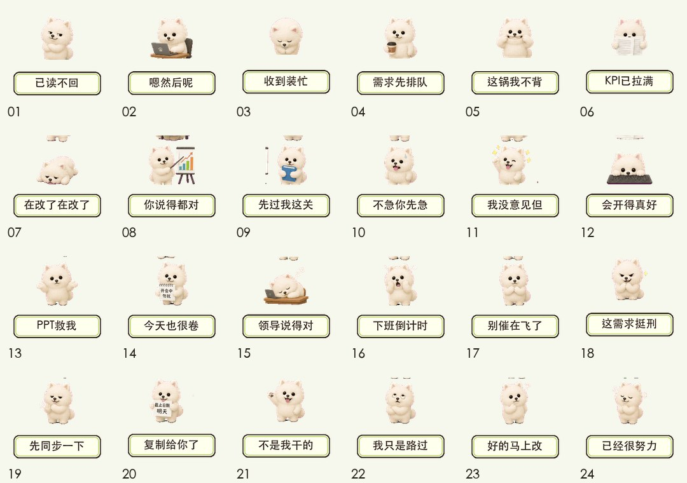
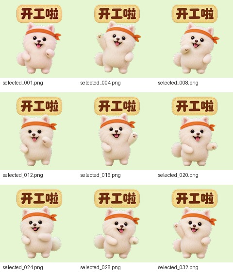
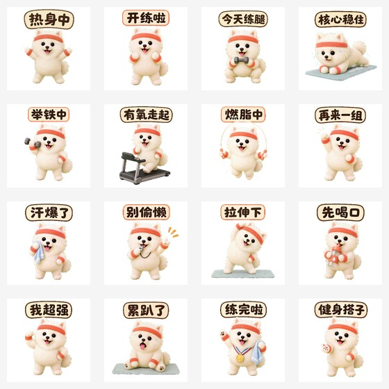

# Examples

These are compact case notes from recent local test runs. The preview images are included as small review artifacts, not as production source files.

## Static Case: Gemin Workplace 24-Pack

Preview:



Summary:

- Type: static 24-pack.
- Theme: workplace reaction stickers.
- Main workflow: one generated artwork per sticker, local postprocess for sizing, transparency, thumbnails, metadata, preview, and QC.
- QC: production `ok: true`, `0 failed`.
- Lesson kept in the skill: static albums should prefer `main/NN.png` for new packs, avoid a single 24-up sheet as production source, and keep generated text compositions only when they remain readable.

Prompt shape:

```text
Use $generate-wechat-stickers to create a static 24-pack WeChat sticker album.
Character: fluffy white puppy named Gemin.
Theme: workplace reactions.
Style: cute, expressive, clean sticker text, strong subject scale.
Include cover, icon, banner, reward guide, reward thanks, metadata, preview, and QC.
```

## Animated Case: Seedance Green-Screen Pilot

Preview contact sheet:



Summary:

- Type: animated Seedance pilot for a planned 16-pack.
- Mode: `green_screen_video`.
- Input: generated start frame + generated end frame.
- Model route: Doubao Seedance 1.5 Pro first-last-frame video generation.
- Output: MP4, transparent GIF, thumbnail, pilot QC report.
- Lesson kept in the skill: once video mode is locked, do not downgrade to local cutout loops because of time or cost. Stop and ask the user instead.

Prompt shape:

```text
Use $generate-wechat-stickers to create an animated 16-pack.
Character: fluffy white puppy named Gemin.
Theme: positive encouragement.
Mode: transparent GIF with Seedance first-last-frame video.
Make one pilot first; do not fall back to sprite sheet or local still loop without approval.
```

## Animated Draft Case: Fitness 16-Pack

Preview:



Summary:

- Type: animated 16-pack draft.
- Theme: puppy sports and fitness.
- Result: visually useful as a draft, but strict production QC was not green.
- Key failures: large action caused motion stability outliers and some edge/keying issues.
- Lesson kept in the skill: distinguish draft-review QC from submission-ready QC, and do not call a folder WeChat-ready until the current production QC report is actually `ok: true`.

Prompt shape:

```text
Use $generate-wechat-stickers to create an animated 16-pack.
Character: fluffy white puppy mascot.
Theme: sports and fitness.
Mode: Seedance video route.
Deliver a draft preview first; mark it clearly if production QC is not green.
```

## What These Examples Are Not

- They are not reusable source art.
- They are not a promise that every future pack will pass QC on the first try.
- They should not be used to build new stickers by cropping, copying, or tracing.
- They are workflow examples showing how to plan, generate, review, and gate outputs.
